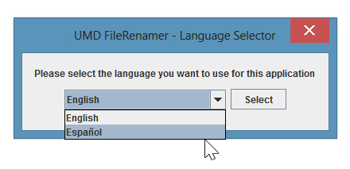
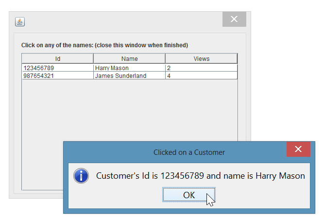

## SwingHelper
This is the **official** GitHub repository of the SwingHelper project (known as sidereal-libraries), created on September 2013 and originally hosted at Google Code, now archived. For reference go to https://code.google.com/archive/p/sidereal-libraries/. SwingHelper packages were rebranded to *BrosMakingSoftware* in order to match the format of its new home.

The following documentation is based on the *Swing's Little Helper* article published at https://www.codeproject.com/Articles/662256/Swings-Little-Helper. It was updated to fix some grammar issues, to make it simpler to read and it has been reformatted to match Markdown syntax.

## Introduction
Swing is the primary Java GUI widget toolkit. It is easy to use but there are things that can be improved,  like assumptions of defaults values (for example all the parameters to display a simple Information Message Dialog), and the usage of flexible collections when binding properties to Swing components.

**SwingHelper** improves these areas by implementing some default parameters encapsulated in convenient methods to make easier invocations of some components like messages and dialogs, as well as implementing collections on some models.

## Background
Swing is the primary Java GUI, but it is not the only one available for Java to create desktop applications, we can find AWT, SWT, SwingX, JavaFX, Apache Pivot, and many others.

AWT was the first Java GUI, and Swing is its successor. Swing was created to provide rich components completely written on Java, which means that they are not implemented by platform-specific code, it is also known as “lightweight” elements, the ability of Swing to render their own components by painting them using Java2D APIs and not depending of native user interface toolkits.

One of the reasons why we choose Swing to work on our projects is because it is completely written on Java and it is included on the JVM, so no extra libraries are needed, also we can create OS-independent applications using the Look and Feel we want, they can be one of the Java's defaults look and feels that looks the same on all platforms, or our favorite, the current OS look and feel, all in one pure jar that is executable in any platform, literally “write once, run anywhere”.

SwingHelper was made to help you create beautiful UI experiences. We want to disprove the myth that Java only delivers ugly look and feels, and the myth that you need OS-specific libraries to make it work.

## Using the code
What is SwingHelper?  
It is an open-source library written on Java, it is a set of common invocations to components that reduces complexity assuming default values. Also it implements some AbstractModels to bind data with components, just in seconds!

### Downloading the library
Download the latest version available at https://github.com/BrosMakingSoftware/SwingHelper/releases

### Running examples
SwingHelper is a Maven project, you should be able to build it and run a test to see a demo of all the features. Follow the instructions displayed on each Dialog to complete the test. All the code displayed on this documentation can be found on the test packages of this project.

### The `SwingHelper` class
This class contains the following features:

* Sets the Look and Feel of the whole application:  
Note: The `System` Look and Feel is **always** set as default when using SwingHelper, instead
of the `Metal` one (Java's default)
 ```java
 SwingHelper.setLookAndFeel(SwingHelper.LookAndFeel.NIMBUS);
 //or
 SwingHelper.setLookAndFeel(SwingHelper.LookAndFeel.MOTIF);
 //or
 SwingHelper.setLookAndFeel(SwingHelper.LookAndFeel.METAL);
 //or
 SwingHelper.setLookAndFeel(SwingHelper.LookAndFeel.SYSTEM);
 ```

* When using `Metal` Look and Feel, you can change its themes by using:
 ```java
 SwingHelper.setMetalTheme(SwingHelper.MetalTheme.DEFAULT_METAL);
 //or
 SwingHelper.setMetalTheme(SwingHelper.MetalTheme.OCEAN);
 ```

* Centers the windows:
 ```java
 SwingHelper.centerWindow(customerJDialog);
 ```

* Displays error messages:
 ```java
 SwingHelper.showErrorMessage("Error title", "This is an error message.");
 ```

* Displays warning messages:
 ```java
 SwingHelper.showWarningMessage("Warning title", "This is a warning message.");
 ```

* Displays information messages:
 ```java
 SwingHelper.showInformationMessage("Information title", "This is an information message.");
 ```

* Displays Input Dialogs asking for required values:
 ```java
 String result =
 SwingHelper.askForRequiredTextUsingInputDialog("Text request", "Write your name:");
 ```

* Displays Confirmation Dialogs with `Yes/No`, `Yes/No/Cancel` or `OK/Cancel` buttons:
 ```java
 String title = "Click on a button to confirm";
 String message = "Click on YES button";

 String result = SwingHelper.showConfirmationDialogWithYesNoButtons(title, message);

 if(result.equals("yes")){
    // Write your logic here...
 }
 ```

* Displays File Choosers asking for folders:
 ```java
 String title = "Choose a folder"
 String startDirectory = "target/test-classes/com/diegohp/swing/";

 File result = SwingHelper.chooseDirectory(title, startDirectory);
 // Use 'result' as your folder
 ```

* Displays File Choosers asking for files:
 ```java
 String title = "Choose any file";

 File result = SwingHelper.chooseFile(title);
 // Use 'result' as your file
 ```

* Displays File Choosers asking for files with an specific extension:
 ```java
 String title = "Choose a text file";
 String fileExtension = ".txt";

 File result = SwingHelper.chooseFile(title, fileExtension);
 // Use 'result' as your file
 ```

All of these features have more specific parameters (some of them omitted in the above examples), you should be able to define different parameters to change the behavior as needed.

The most common parameters are: `title` (of the window), `startDirectory` (the folder that a file chooser opens as default), `fileExtension` (the extension of the file to be selected), `startFile` (the file that a file chooser selects as default), `lookAndFeel` (one of the options of an enum of the same name), `metalTheme` (one of the options of another enum of the same name), `message` (the message displayed on message window).

### The `ListComboBoxModel` class
This class contains the following features:

* Extends `AbstractListModel` and implements `MutableComboBoxModel`. All methods are implemented.

* `AbstractListModel` gives the ability to use a List as the data container (in this case, an ArrayList with parameterized type)

* `MutableComboBoxModel` gives the ability to change its data even after the UI component was displayed

Example:  
We are going to create a window that asks the user to select a language from a combo box.  
Let's declare a JDialog with a Combo Box and a button:
```java
public class LanguageSelectorJDialog extends javax.swing.JDialog {
    private javax.swing.JComboBox jComboBoxLanguages;
    private javax.swing.JButton jButtonSelect;
}
```

Now use `ListComboBoxModel` to create the model of the Combo Box:
```java
private ListComboBoxModel<String> languagesListComboBoxModel;
```

Note: in this case the parameterized type of the container was set to `<String>`, this is a trivial example just to demonstrate that any class can fit this place, even your custom classes like pojos, the only requirements is that they must override the `toString()` method (component uses this value as the display text), to return something understandable by the user, but if it is not your case, you will need to create a wrapper class to provide a different `toString()` implementation.

Next, on the constructor of the JDialog we are going to populate the model with data:
```java
this.languagesListComboBoxModel.addElement("English");
this.languagesListComboBoxModel.addElement("Español");
```

Now we are going to implement the logic of the click event of the select button:
```java
private void jButtonSelectActionPerformed(java.awt.event.ActionEvent evt) {

  // See how easy is to get the selected object of the combo
  String selected = (String) this.languagesListComboBoxModel.getSelectedItem();

  // Then implement your logic
  if (selected.equals("English")) {
    Locale.setDefault(Locale.ENGLISH);
    System.out.println("Language set to English");
  }
  else {
    Locale.setDefault(new Locale("es"));
    System.out.println("Language set to Spanish");
  }
}
```

This is how the final result looks like, this is an actual screenshot of one of our applications which uses this logic:  


This is a pretty easy example of a usage of the `ListComboBoxModel` class, but remember the ability of the parameterized type. Let's think in a more complex scenario, were instead of `String` we have a custom class called `Language`, that has a name (English, Spanish) and a number of language (345, 874) and the list of languages are not limited to only 2, they can be more based on the records of a data base. Fist you need to override the `toString()` method of the Language class to return just the name (since the user is not going to understand the number of language), then you just need to add all the list of languages to the model and when the user selects a language and clicks on select button, the model returns the whole selected object, in this case a Language object directly. With this feature you avoid the creation of auxiliary lists to represent indexes of the real objects.

### The `ListTableModel` class
This class contains the following features:

* Extends from `AbstractTableModel`, it implements all the methods as much as it can, leaving just one method to be implemented, `getValueAt(int row, int col)`, which is very easy, you just need to return the value of the corresponding column. When trying to implement an `AbstractTableModel` you get around a 40% of the class, using `ListTableModel` you get a 99% of the implementation with a flexible and mutable logic.

* It has a List of Strings where you can set the columns names, you can change them even after the component was displayed

* Implements the usage of a List as a data container (in this case, an `ArrayList` with parameterized type), very useful when displaying and editing information on a table

Example:  
For this scenario we are going to create a window with a table of customers, when a customer is clicked, a message is displayed with their information and a count of views, which is incremented each time you click them.

First, let's create an entity class of Customer:
```java
public class Customer {
  private Long id;
  private String name;
  private Integer views;

  // All setters an getters
}
```

Now, let's create a `JDialog` with a table, a model and a Customer object to keep the selected customer:
```java
public class CustomerTableModelJDialog extends javax.swing.JDialog {

    private javax.swing.JTable jTableCustomers;
    private ListTableModel<Customer> customersListTableModel;
    private Customer customerSelected;
}
```

Once the model is declared, we need to create its instance by implementing the remaining method to get the display values of each column. In this case our first column will display the Id of the customers, the second column displays the name and the third column displays the numbers of views:
```java
this.customersListTableModel = new ListTableModel<Customer>() {
    @Override
    public Object getValueAt(int row, int col) {
        Customer customer = this.objects.get(row);
        if (col == 0) {
            return customer.getId();
        }
        if (col == 1) {
            return customer.getName();
        }
        if (col == 2) {
            return customer.getViews();
        }
        return customer.getId() + " -> " + customer.getName();
    }
};
```

Now we need to declare the names of the headers of the table:
```java
List<String> columnsNames = new ArrayList<String>();
columnsNames.add("Id");
columnsNames.add("Name");
columnsNames.add("Views");

this.customersListTableModel.setColumnNames(columnsNames);
```

The next step is to create a listener to capture the value changed event and implement some specific logic when a customer is selected:
```java
this.jTableCustomers.getSelectionModel().addListSelectionListener(new ListSelectionListener() {

@Override
public void valueChanged(ListSelectionEvent lse) {

  if (!lse.getValueIsAdjusting()) {

    ListSelectionModel model = jTableCustomers.getSelectionModel();

    if (model.getLeadSelectionIndex() >= 0) {
      customerSelected = ((ListTableModel<Customer>)jTableCustomers.getModel()).getObjectAt(model.getLeadSelectionIndex());

      // Now we got the customer, let's implement our logic
      customerSelected.setViews(customerSelected.getViews() + 1);

      // Now call fireTableDataChanged so the table updates the data displayed
      customersListTableModel.fireTableDataChanged();

      // Now display some information of the customer
      SwingHelper.showInformationMessage(
        "Clicked on a Customer",
        "Customer's Id is " + customerSelected.getId()
        + " and name is " + customerSelected.getName());
      }
    }
  }
});
```

Once the model is ready, let's set it to the table:
```java
this.jTableCustomers.setModel(this.customersListTableModel);
```

In order to populate the table, we need to create some customers, add them to the table and update the changes:
```java
List<Customer> customers = new ArrayList<Customer>();

Customer c1 = new Customer();
c1.setId(123456789L);
c1.setName("Harry Mason");
c1.setViews(0);

Customer c2 = new Customer();
c2.setId(987654321L);
c2.setName("James Sunderland");
c2.setViews(0);

customers.add(c1);
customers.add(c2);

this.customersListTableModel.addObjectList(customers);
this.customersListTableModel.fireTableDataChanged();
```

And that's it! You will see something like this:  
s
